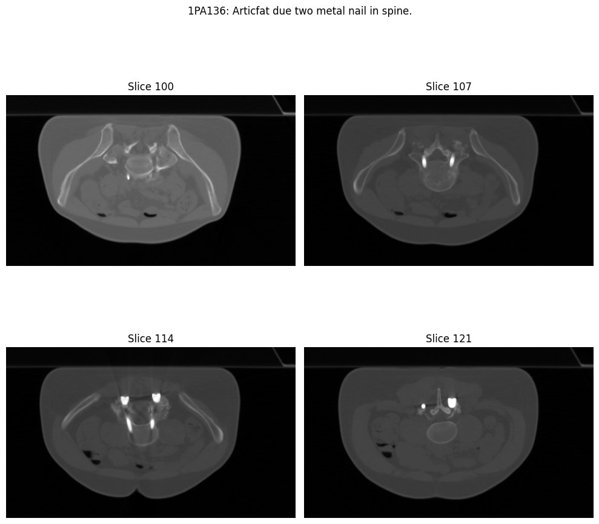

# sct-ood-dataset

## Labeling
### HU>2000
Using HU as a threshold is not ideal for all cases, as it may not account for variations in tissue density and composition.

Refer [notebook2](notebooks/2_ct_HU_stats_pelvis.ipynb) for following visualizations.

Refer [notebook3](notebooks/3_ct_HU_label_coverage_analysis.ipynb) for following visualizations.

### Per Scan Thresholding

Using max HU value from all other normal slices as global threshold gives good performance on slice-level segmentation.

Refer [notebook4](notebooks/4_ct_scan_visualization.ipynb) for following visualizations.

